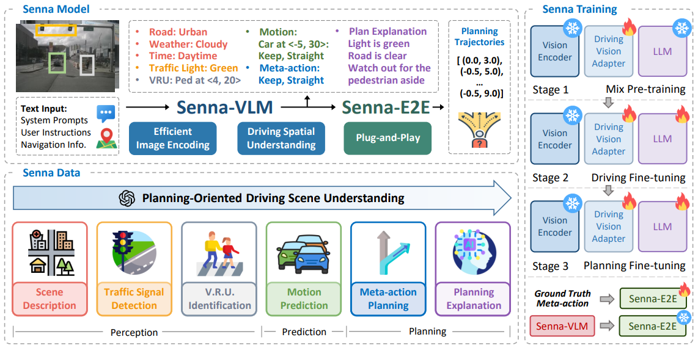
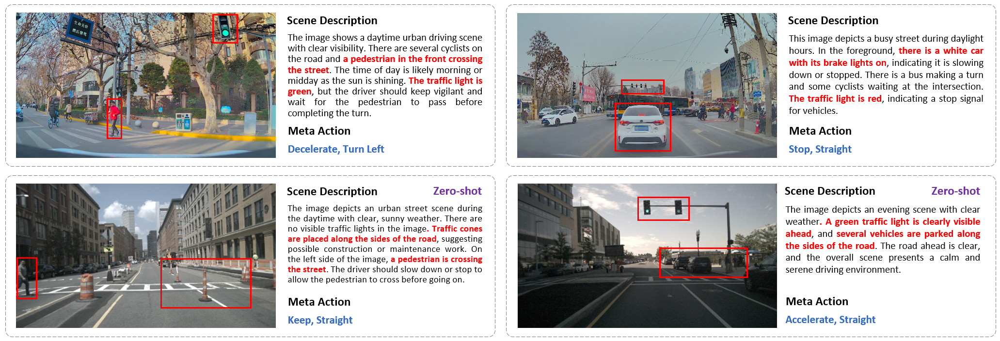

<div align ="center">


<h3> Senna: Bridging Large Vision-Language Models and End-to-End Autonomous Driving </h3>

[Bo Jiang](https://scholar.google.com/citations?user=UlDxGP0AAAAJ&hl=zh-CN)<sup>1</sup>, [Shaoyu Chen](https://scholar.google.com/citations?user=PIeNN2gAAAAJ&hl=en&oi=sra)<sup>1</sup>, [Bencheng Liao](https://scholar.google.com/citations?user=rUBdh_sAAAAJ&hl=zh-CN)<sup>1</sup>, Xingyu Zhang<sup>2</sup>, Wei Yin<sup>2</sup>, [Qian Zhang](https://scholar.google.com/citations?user=pCY-bikAAAAJ&hl=zh-CN)<sup>2</sup>, [Chang Huang](https://scholar.google.com/citations?user=IyyEKyIAAAAJ&hl=zh-CN)<sup>2</sup>, [Wenyu Liu](http://eic.hust.edu.cn/professor/liuwenyu/)<sup>1</sup>, [Xinggang Wang](https://xwcv.github.io/)<sup>1,📧</sup>

<sup>1</sup> Huazhong University of Science and Technology,
<sup>2</sup> Horizon Robotics,
<sup>📧</sup> corresponding author


[](https://arxiv.org/abs/2410.22313)
[](https://huggingface.co/rb93dett/Senna)
</div>


https://github.com/user-attachments/assets/3fd172be-d78d-47ae-867d-a473a1e6ddd6


## News

`[2024-12-08]:` We have released the code and weight of Senna-VLM, along with the training and evaluation scripts.

`[2024-10-29]:` Senna [arXiv](https://arxiv.org/abs/2410.22313) paper released. Code/Models are coming soon. Please stay tuned! ☕️


## Highlights

* Senna is an autonomous driving system that integrates a Large Vision-Language Model with an end-to-end model to improve planning safety, robustness and generalization.

* Senna achieves SOTA planning performance and demonstrates strong cross-scenario generalization and transferability.

<div align="center">

</div>

## Getting Started
### Installtion
```shell
git clone git@github.com:hustvl/Senna.git
conda create -n senna python=3.10 -y
conda activate senna
pip install -r requirements.txt
```

### Data Preparation
We provide a [script](https://github.com/hustvl/Senna/blob/main/data_tools/senna_nusc_data_converter.py) for generating QA data required for Senna training. The script uses [LLaVA-v1.6-34b](https://huggingface.co/liuhaotian/llava-v1.6-34b) as the model for generating scene descriptions and planning explanations. You can run the script as follows:
```shell
sh data_tools/senna_nusc_converter.sh
```

### Weights

| Method | Model Size | Base LLM | Input View | Token per Image | Download |
| :---: | :---: | :---: | :---: |  :---: | :---: |
| Senna | 7B | vicuna-7b-v1.5 | 6 View | 128 | [Hugging Face](https://huggingface.co/rb93dett/Senna) |


### Training
For Stage-1 Mix Pre-training:
```shell
sh train_tools/pretrain_senna_llava.sh
```
For Stage-2 Driving Fine-tuning and Stage-3 Planning Fine-tuning (full-parameter fine-tuning):
```shell
sh train_tools/train_senna_llava.sh
```
For Stage-2 Driving Fine-tuning and Stage-3 Planning Fine-tuning (LoRA fine-tuning):
```shell
sh train_tools/train_senna_llava_lora.sh
```
In our experiments, we observed that full-parameter fine-tuning outperforms LoRA fine-tuning. Therefore, we recommend using full-parameter fine-tuning. However, if your machine has limited GPU memory (e.g., only 24GB), you may consider using LoRA fine-tuning as an alternative.

### Evaluation
You can evaluate the accuracy of Senna meta-action planning using the script below.
```shell
sh eval_tools/senna_plan_cmd_eval_multi_img.sh
```

### Visualization
By running the visualization script below, you can overlay the predicted meta-actions and front-view scene descriptions onto the front-view image and save the results to the specified path.
```shell
sh eval_tools/senna_plan_visualization.sh
```


## Qualitative Results


<div align="center">

</div>


## Acknowledgments

[LLaVA](https://github.com/haotian-liu/LLaVA), the codebase we built upon, we sincerely thank the contributors for their great work!

## Citation
If you find Senna useful in your research or applications, please consider giving us a star &#127775; and citing it by the following BibTeX entry.


```bibtex
@article{jiang2024senna,
      title={Senna: Bridging Large Vision-Language Models and End-to-End Autonomous Driving}, 
      author={Bo Jiang and Shaoyu Chen and Bencheng Liao and Xingyu Zhang and Wei Yin and Qian Zhang and Chang Huang and Wenyu Liu and Xinggang Wang},
      year={2024},
      eprint={2410.22313},
      archivePrefix={arXiv},
      primaryClass={cs.CV},
      url={https://arxiv.org/abs/2410.22313}, 
}
```

## Related Projects
[VAD & VADv2](https://github.com/hustvl/VAD), [MapTR](https://github.com/hustvl/MapTR)
